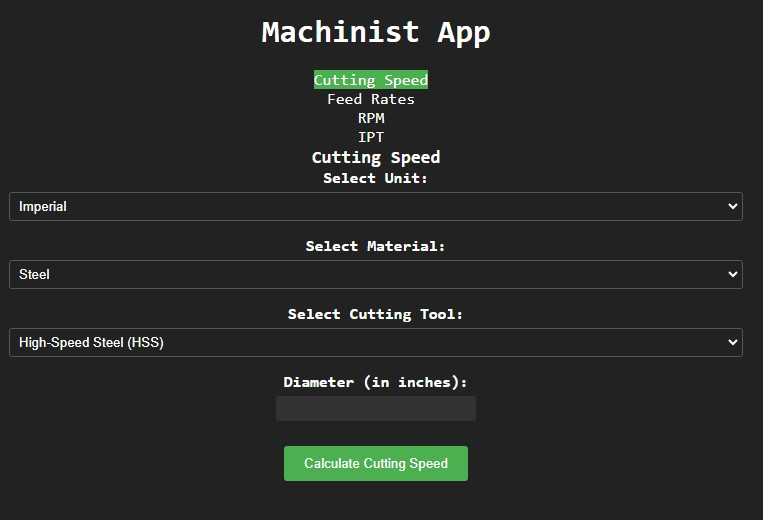

# Machinist Calculator

## Description

The app I am developing is a comprehensive machining toolkit designed to assist machinists in their day-to-day operations. It offers a range of essential features and tools to streamline machining processes and improve efficiency. The app provides quick access to a database of cutting speeds, feeds, and recommended parameters for various materials, allowing machinists to make informed decisions while setting up their machines. Additionally, it includes a toolbox with essential calculators for speeds and feeds, thread measurements, tolerances, and conversions, eliminating the need for manual calculations. With a user-friendly interface and real-time updates, this app aims to be an indispensable companion for machinists, empowering them to optimize their machining operations and enhance productivity.

## Live site

## Features

- Cutting Speed Calculation: Calculate the cutting speed based on the selected operation (milling, drilling, or lathe), unit (imperial or metric), diameter, and spindle speed.
- Feed Rates Calculation: Calculate the feed rates based on the selected unit, spindle speed, and number of teeth.
- RPM Calculation: Calculate the RPM (Revolutions Per Minute) based on the selected unit, cutting speed, and diameter.
- IPT (Inches Per Tooth) Calculation: Calculate the IPT based on the selected unit, feed rate, and spindle speed.

## Getting Started

1. Clone the repository: `git clone git@github.com:scottskinn/Machinist_Calculator.git`
2. Install the dependencies: `npm install`
3. Start the development server: `npm start`

## Technologies Used

- React: JavaScript library for building user interfaces
- React Router: Library for routing within a React application

## Project Structure

The project structure is as follows:

- `src/`: Contains the source code of the app.
  - `pages/`: Contains the main page components.
  - `styles/`: Contains the CSS styles for the app.
- `public/`: Contains the public assets (HTML, images, etc.).
- `App.js`: The main entry point of the application.
- `index.js`: Renders the app into the DOM.

## Contributing

Contributions are welcome! If you have any ideas, suggestions, or bug reports, please open an issue or submit a pull request.

## License

This project is licensed under the [MIT License](LICENSE).

## Attributes

<a href="https://www.flaticon.com/free-icons/drill" title="drill icons">Drill icons created by Smashicons - Flaticon</a>
